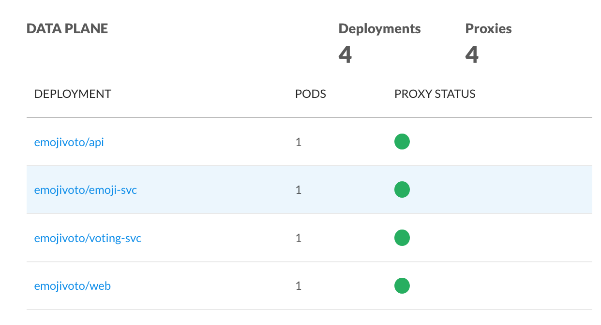

# 向网格添加服务

为了使您的服务能够使用Conduit，它需要添加到服务网格中。这是通过使用Conduit CLI添加Conduit代理sidecar到每个pod。通过滚动更新，您的应用程序的可用性不会受到影响。

##先决条件

- 当前版本Conduit,0.1.0,仅支持HTTP/2(包括 gRPC)，您的服务在pod外部进行的任何网络调用都必须是HTTP/2。
- 您的服务可能会收到非HTTP/2流量，但必须明确配置为跳过代理，并且此流量对服务网格不可见（请参阅[非HTTP/2流量](#non-http-2-traffic)）。
- 由于早期版本中的[bug](https://github.com/grpc/grpc-go/issues/1120)，使用grpc-go的服务必须使用grpc-go版本1.3或更高版本。
- 您必须已经在本地安装了Conduit CLI，并且在您的Kubernetes群集中安装了Conduit服务网格。有关详细信息，请参阅[入门指南](/getting-started)。

## 添加你的服务

要将服务添加到服务网格，只需运行此命令：
~~~
conduit inject deployment.yml | kubectl apply -f -
~~~
其中`deployment.yml`是包含您应用的Kubernetes配置文件。这将触发deployment的滚动更新，将每个pod替换为另外包含Conduit sidecar代理的新pod。

如果Conduit仪表板中的代理状态为绿色，您将知道您的服务已成功添加到服务网格中。

您可以随时进入运行中的Conduit仪表板
~~~
conduit dashboard
~~~
##非HTTP/2流量
截至当前版本，Conduit代理仅支持HTTP/2。如果您的服务收到非HTTP/2流量，您可以配置一个入站端口列表，这将绕过代理并直接进入您的应用程序。绕过代理的流量对于服务网格不可见。
您可以将绕过conduit的入站端口列表配置以逗号分割通过`--skip-inbound-ports`参数递给`conduit inject`。例如，要允许端口80和7777上的入站流量绕过代理，请使用以下命令：
~~~
conduit inject deployment.yml --skip-inbound-ports=80,7777 | kubectl apply -f -
~~~