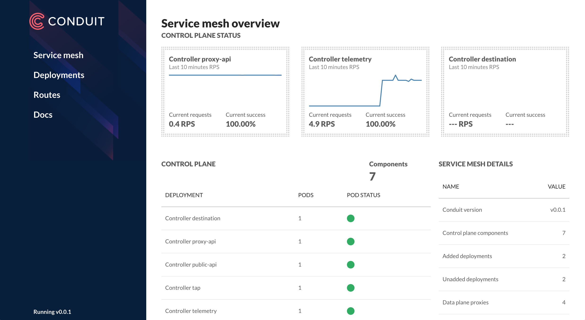

# 入门

Conduit是一个面向Kubernetes的超轻量Service Mesh。他对运行在Kubernetes中的服务间通信进行透明的管理，让服务变得更加安全和可靠。在不需要变更代码的前提下，Conduit微服务提供了可靠性、安全性和可监控的特性。

Conduit有两个基础组件：_数据平面_由轻量级代理组成，这些代理部署为sidecar容器，与每个服务代码的实例在一起；_控制平面_ 则用来对这些代理进行协调和管理。用户可以使用命令行界面（CLI）来和Service Mesh进行交互，另外还有Web应用用于控制集群。

本文会谈到如何在Kubernetes集群中部署Conduit，并在其上运行一个gRPC示例应用。注意Conduit 0.1是一个Alpha版本。他Alpha到什么程度呢？目前仅提供了HTTP/2（包括gRPC），甚至HTTP/1.1也不被支持。如果你没有HTTP/2应用，也不用担心，我们已经提供示例应用给你尝试。

## 先决条件

需要运行Kubernetes 1.8版本的集群，还有在本机可正常工作的`kubectl`命令。可以用下面的命令来检查是否符合需要：

```bash
$ kubectl version --short
```

应该会看到类似这样的内容：

```bash
Client Version: v1.8.3
Server Version: v1.8.0
```

请确认"Server Version"内容是1.8或以上。如果返回内容不是上面的情况，或者`kubectl`返回了错误信息，可能是集群不存在或者没有正确配置（如果想要快速简便的在本机运行Kubernetes，我们建议使用[Minikube](https://kubernetes.io/docs/getting-started-guides/minikube/)，需要注意的是，要求0.24.1或其后的版本。）

## 安装CLI

如果你是首次运行Conduit，需要下载命令行接口工具（CLI）到本机，然后使用CLI在Kubernetes集群上安装Conduit。

运行下列命令，开始安装CLI：

```bash
curl https://run.conduit.io/install | sh
```

然后跟随指示即可。

另外，还可以直接在[Conduit发布页面](https://github.com/runconduit/conduit/releases)下载CLI；或者可以从[Conduit Github](https://github.com/runconduit/conduit)克隆源代码，根据README指导自行Build。

CLI安装之后，用下面命令检查一下：

```bash
conduit version
```

应该会看到类似的内容：

```bash
Client version: v0.1.0
Server version: unavailable
```

## 在集群上安装Conduit

现在本机安装好了CLI了，是时候在Kubernetes集群上安装Conduit的控制平面了。不要担心目前集群上运行的其他应用——控制平面会安装在单独的`conduit`命名空间，所以要删除也是很容易的。

运行下面的命令：

```bash
conduit install | kubectl apply -f -
conduit dashboard
```

第一个命令生成Kubernetes配置，然后用管道输出给`kubectl`。Kubectl随后把配置应用到Kubernetes集群。（可以把这个命令拆成两个命令，来观察在应用之前发生了什么，例如`conduit install > foo.yml; cat foo.yml`）。

第二个命令在浏览器窗口中加载仪表盘，如果你看到下图类似的内容，那么恭喜你，Conduit已经在你的集群上运行。



当然，目前还没有任何服务运行在Service Mesh之中，所以仪表盘没有什么内容，只显示了Service Mesh自身的情况。

## 安装演示应用

终于，到了安装演示应用并添加到mesh的环节了。完成这所有只需要运行下面的一条命令：

```bash
curl https://raw.githubusercontent.com/runconduit/conduit-examples/master/emojivoto/emojivoto.yml | conduit inject - --skip-inbound-ports=80 | kubectl apply -f -
```

这个的命令下载示例gRPC应用的Kuberneetes配置，然后通过`conduit inject`运行配置。这将重写配置，在应用Pod中插入Conduit数据平面代理，作为sidecar容器。最后，`kubectl`应用这些配置到Kubernetes集群。

和用`conduit install`类似，在这个命令中，Conduit CLI只是简单地进行文本转换而`kubectl`做了大量工作来把配置实际应用到Kubernetes集群。以这种方式，可以在管道中引入额外的过滤器，或者单独运行命令来观察每个命令的输出。

至此，这个应用就在Kubernetes集群上运行了，并且（它还不知道！）也被加入到了Conduit的Service Mesh之中。

## 观察运行情况

浏览一下Conduit的仪表盘，则应该会看到演示应用的所有HTTP/2服务，这些服务在已添加到Conduit网格的部署列表中显示。

我们可以用下面的URL查看应用：

```bash
minikube -n emojivoto service web-svc --url # on minikube
kubectl get svc web-svc -n emojivoto -o jsonpath="{.status.loadBalancer.ingress[0].*}" # on GKE
```

为了让仪表盘生动一些，我们可以编程生成一些流量。首先，我们需要IP地址：

```bash
INGRESS=$(minikube -n emojivoto service web-svc --url | cut -f 3 -d / -) # on minikube
INGRESS=$(kubectl get svc web-svc -n emojivoto -o jsonpath="{.status.loadBalancer.ingress[0].*}") # on GKE
```

现在我们用一个简单的循环来生成流量：

```bash
while true; do curl $INGRESS; done
```

最后，我们再看仪表盘（如果尚未运行，运行`conduit dashboard`）。可以浏览所有的作为应用一部分的服务，并查看这些服务：

- 成功率
- 请求率
- 延迟分布区间
- 上下游依赖

以及有关实况流量的其他各种信息。整洁，对不？

## 使用CLI

当然，仪表盘不是观测Conduit Service Mesh的唯一手段。CLI提供了很多有趣又强大的命令可以用来体验，包括：

- `conduit stat`
- `conduit tap`

试试看运行`conduit stat deployments`和`conduit tap deploy default/xxx`，看看会有什么发现。

## 总结

这就是我们的入门指南。要获得关于Conduit的更多信息，可以查看[概述](../docs/index.md)和[路线图](../roadmap/index.md)，或者加入[Linkerd Slack](https://slack.linkerd.io/)的`#conduit`频道，以及浏览[Conduit论坛](https://discourse.linkerd.io/c/conduit)。还可以在Twitter上关注[@runconduit](https://twitter.com/runconduit)。我们刚刚开始Conduit的构建工作，我们对您的反馈非常感兴趣！
